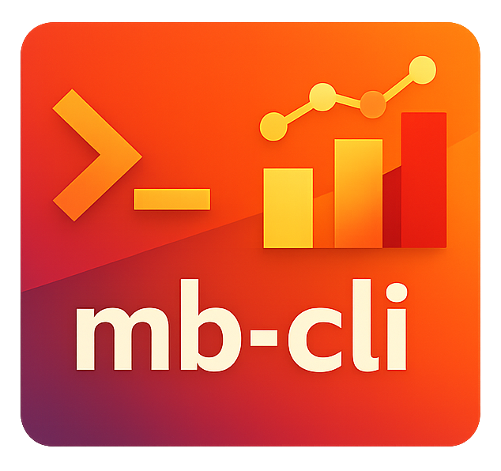

# mb-cli



A read-only CLI for the Metabase API. Designed for terminal users and AI coding agents (Claude, Codex) to explore databases, inspect schemas, and run ad-hoc queries.

## Installation

### Homebrew

```bash
brew tap andreagrandi/tap
brew install mb-cli
```

### Binary download

Download the latest release from the [releases page](https://github.com/andreagrandi/mb-cli/releases).

### Go install

```bash
go install github.com/andreagrandi/mb-cli/cmd/mb@latest
```

## Configuration

Set two environment variables:

```bash
export MB_HOST=https://your-metabase-instance.com
export MB_API_KEY=your-api-key
```

Both are required. `MB_HOST` is the base URL of your Metabase instance. `MB_API_KEY` is a [Metabase API key](https://www.metabase.com/docs/latest/people-and-groups/api-keys).

## Usage

### Global flags

| Flag | Description | Default |
|------|-------------|---------|
| `--format`, `-f` | Output format: `json`, `table` | `json` |
| `--verbose`, `-v` | Show request details on stderr | `false` |

### Database commands

```bash
# List all databases
mb-cli database list

# Get database details
mb-cli database get 1

# Full metadata (tables + fields)
mb-cli database metadata 1

# List all fields in a database
mb-cli database fields 1

# List schema names
mb-cli database schemas 1

# List tables in a specific schema
mb-cli database schema 1 public
```

The `database` command has an alias `db`:

```bash
mb-cli db list
```

### Table commands

```bash
# List all tables
mb-cli table list

# Get table details
mb-cli table get 42

# Table metadata with field details
mb-cli table metadata 42

# Foreign key relationships
mb-cli table fks 42

# Raw table data
mb-cli table data 42
```

### Field commands

```bash
# Get field details
mb-cli field get 100

# Summary statistics
mb-cli field summary 100

# Distinct values
mb-cli field values 100
```

### SQL queries

```bash
# Run a SQL query by database ID
mb-cli query sql --db 1 --sql "SELECT * FROM users LIMIT 10"

# Run a SQL query by database name (case-insensitive substring match)
mb-cli query sql --db prod --sql "SELECT count(*) FROM orders"

# Append a LIMIT clause
mb-cli query sql --db 1 --sql "SELECT * FROM users" --limit 5

# Export results as CSV
mb-cli query sql --db 1 --sql "SELECT * FROM users" --export csv
```

The `--db` flag accepts a numeric database ID or a name substring. If the name matches multiple databases, you'll be asked to use the ID instead.

### Saved questions (cards)

```bash
# List all saved questions
mb-cli card list

# Get card details
mb-cli card get 10

# Execute a saved question
mb-cli card run 10
```

### Search

```bash
# Search across all Metabase items
mb-cli search "users"

# Filter by type
mb-cli search "revenue" --models table,card
```

### Version

```bash
mb-cli version
```

## Agent integration

mb-cli is designed to be used by AI coding agents. When piped or used in scripts, output defaults to JSON for easy parsing.

Typical agent workflow:

```bash
# 1. Discover databases
mb-cli database list

# 2. Find relevant tables
mb-cli search "users" --models table

# 3. Inspect table schema
mb-cli table metadata 42

# 4. Query data
mb-cli query sql --db 1 --sql "SELECT id, email FROM users WHERE created_at > '2024-01-01' LIMIT 10"
```

## License

MIT
